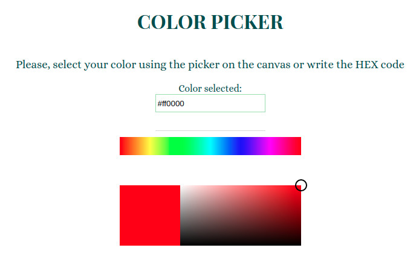

#  **Color Picker**

## **Description:**

Color picker tool

## **Funtionality:**

- Allows the user to select a color from a set by clicking on it.

- Displays the color chosen in a rectangle.

- Shows an input with the color chosen in HEX notation.

- On changing the input, a new color is displayed.

## **Structure:**

1. **Web**

   The web includes an input for the HEX code of the color, a HUE selector, an square where the color selected is shown and the color picker panel.

   

2. **Test**

   The tests are implemented using Cypress.

## **Technologies**:

- HTML
- SCSS
- React
- JavaScript
- PropTypes

## **Run this code in your local system**

1. Clone the repository

2. Web, install the dependencies typing:

```bash
npm install
```

3. Run the code in web/ with:

```bash
npm start
```

## **Run the test**

1. Run the web:

```bash
npm start
```

2. Open a new terminal and type:

```bash
./node_modules/.bin/cypress open
```
